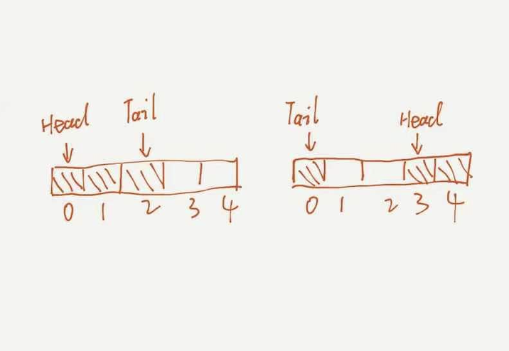

通过数组操作模拟一个环。如下图所示(借用官方的图)

通过上图，我们可以发现，通过以下公式我们就可以得出对位位置。
tailIndex = (headIndex + count − 1) mod capacity

其中 capacity 是数组长度，count 是队列长度，headIndex 和 tailIndex 分别是队首 head 和队尾 tail 索引。

作者：zxhnext
链接：https://leetcode-cn.com/problems/design-circular-queue/solution/she-ji-xun-huan-dui-lie-shu-zu-shi-xian-7125y/
来源：力扣（LeetCode）
著作权归作者所有。商业转载请联系作者获得授权，非商业转载请注明出处。
