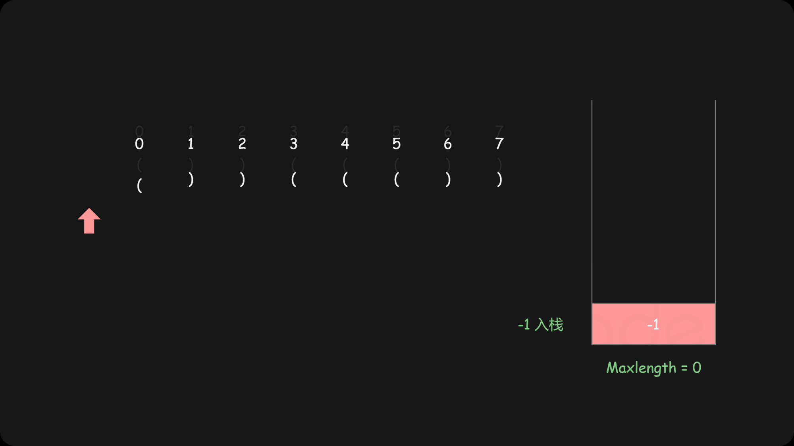
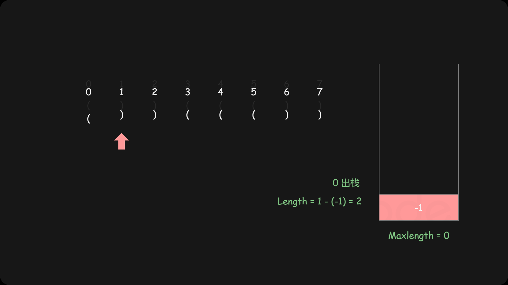
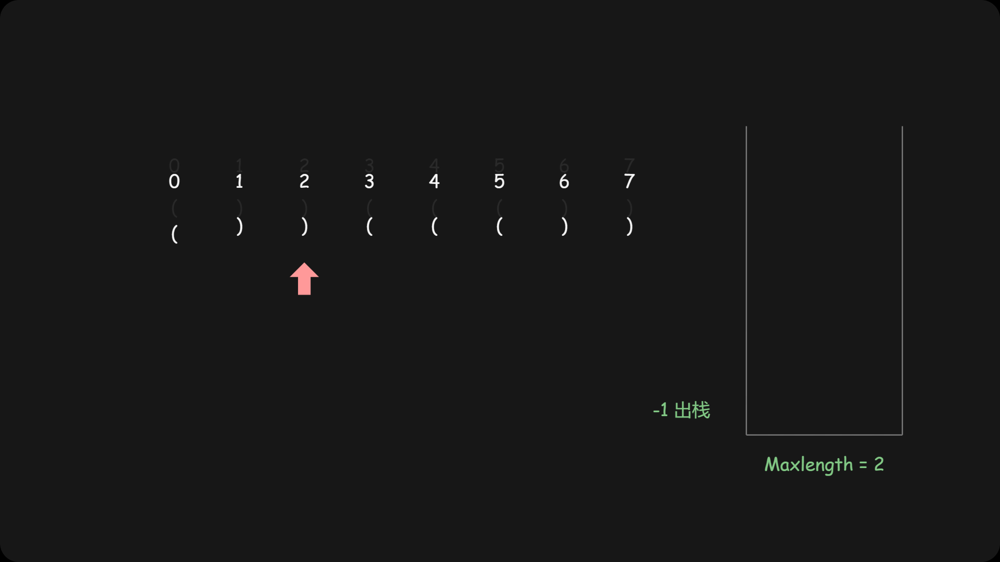
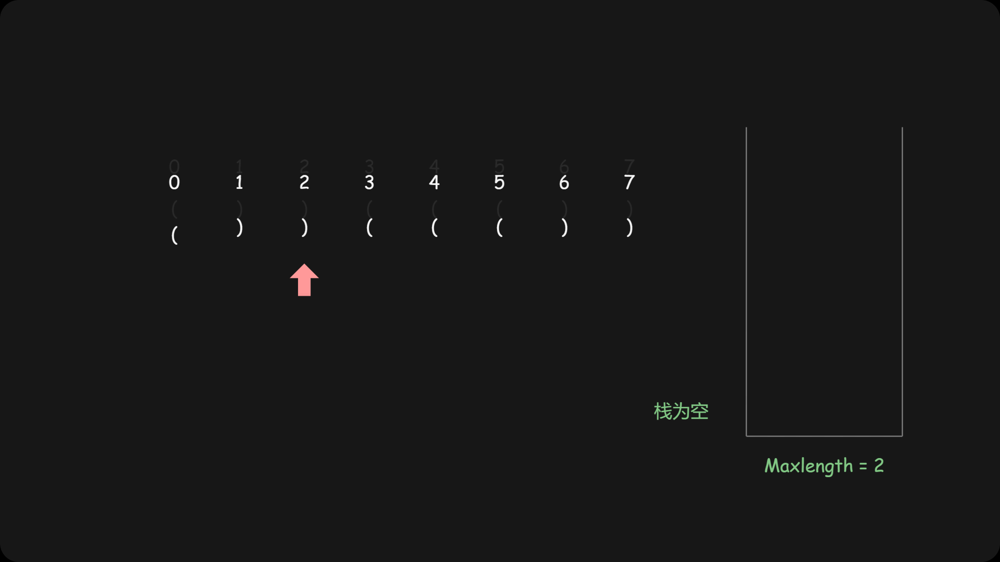
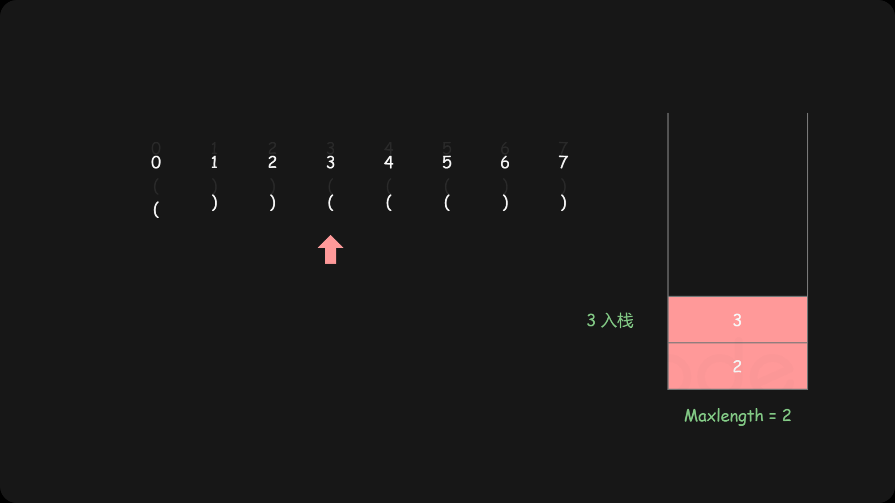
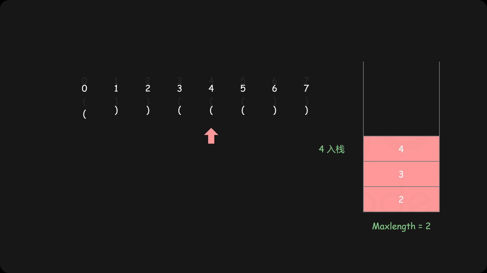
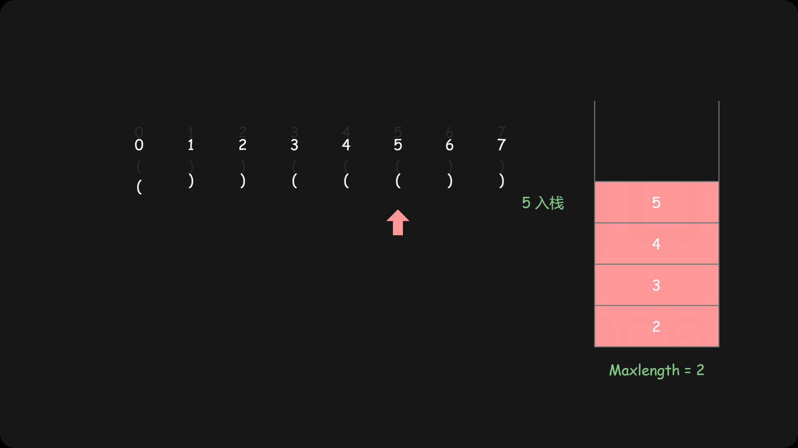
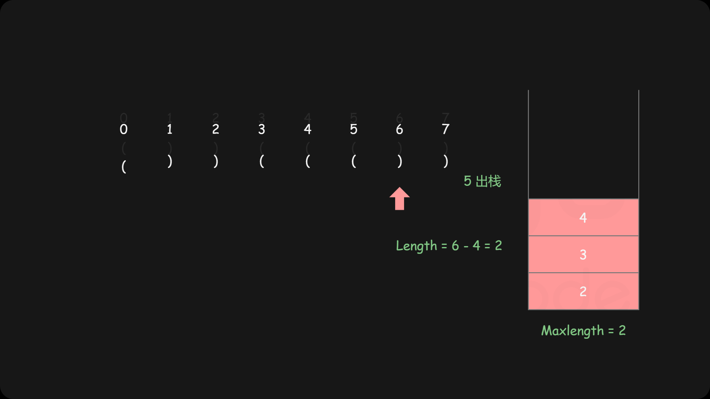
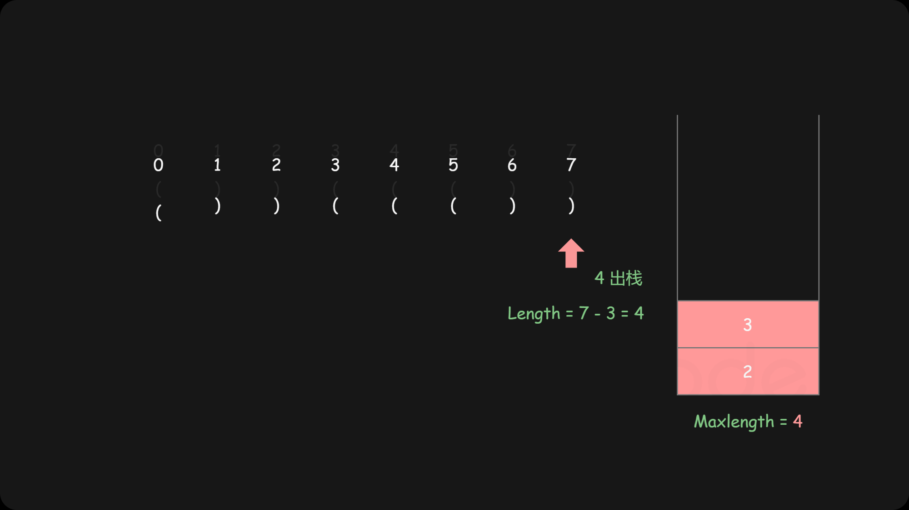

## 最长有效的括号长度
### 思路

1. 栈底先放一个-1进去，这个很巧妙，在后面根据下标计算括号长度时用，相当于是小标从0开始
2. 遇到“(”,下标入栈，继续遍历
3. 遇到“)”,先取出栈顶元素，表示匹配了括号
4. 如果栈空了,证明上一步出栈的是-1，表示“)”未被匹配; 将其下标入栈，作为下一个起点
5. 如果栈未空，表示“)”匹配了，所以最新maxLength = 当前下标 - 栈顶元素
6. 最新的maxLength与之前的maxLength比较, 取最大值

### 图片来源：
https://leetcode-cn.com/problems/longest-valid-parentheses/solution/zui-chang-you-xiao-gua-hao-by-leetcode-solution/

### leetcode题目链接
https://leetcode-cn.com/problems/longest-valid-parentheses/

